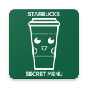

#  Starbuck Secret Menu

Starbucks Secret Menu open-source simple secret menu app for Android. It is built with Dart on top of Google's Flutter Framework.


## List of Contents

1. [Demo](#demo)
2. [Support](#support)
3. [Dependencies](#dependencies)
4. [Usage](#usage)
5. [Contributing](#contributing)

## Demo

**Live Version**

<a href="https://play.google.com/store/apps/details?id=com.bonzdev.starbucksecret" target="_blank"></a>

**Screens**

|  |   | |  |
| :-------------: | :-------------:  | :-------------:  | :-------------:  |
|     Screen1     |    Screen2    |    Screen3     |     Screen4       |

## Support

### How can I support developers?
- Star our GitHub repo
- Create pull requests, submit bugs, suggest new features or documentation updates
- Or consider sponsoring this project.

<a href="https://www.buymeacoffee.com/secretsrecipe" target="_blank"></a>

## Dependencies

The following packages are needed for the development of this application.

- `firebase_core : ^0.7.0` for firebase core
- `cloud_firestore: ^0.16.0+1` for firestore firebase
- `fab_circular_menu: ^1.0.0` for circular menu
- `animated_splash_screen: ^1.0.0+1` for animated splash screen
- `cached_network_image: ^2.1.0` for cached image from network
- `url_launcher: "^5.0.5"` for launching url

More details about these can be found in the [`pubspec.yaml`](https://github.com/Bonzdev/Starbuck-Secret-Menu-Flutter/blob/master/pubspec.yaml) file.

## Usage

More information about the releases can be found in the [Release](https://github.com/Bonzdev/Starbuck-Secret-Menu-Flutter/releases) tab.

## Contributing

First off, thank you for considering contributing to starbucks secret menu app. 

```
DISCLAIMER: Google Play and the Google Play logo are trademarks of Google LLC.
```

# License

```
Copyright 2020 obnil

Licensed under the Apache License, Version 2.0 (the "License");
you may not use this file except in compliance with the License.
You may obtain a copy of the License at

   http://www.apache.org/licenses/LICENSE-2.0

Unless required by applicable law or agreed to in writing, software
distributed under the License is distributed on an "AS IS" BASIS,
WITHOUT WARRANTIES OR CONDITIONS OF ANY KIND, either express or implied.
See the License for the specific language governing permissions and
limitations under the License.
```